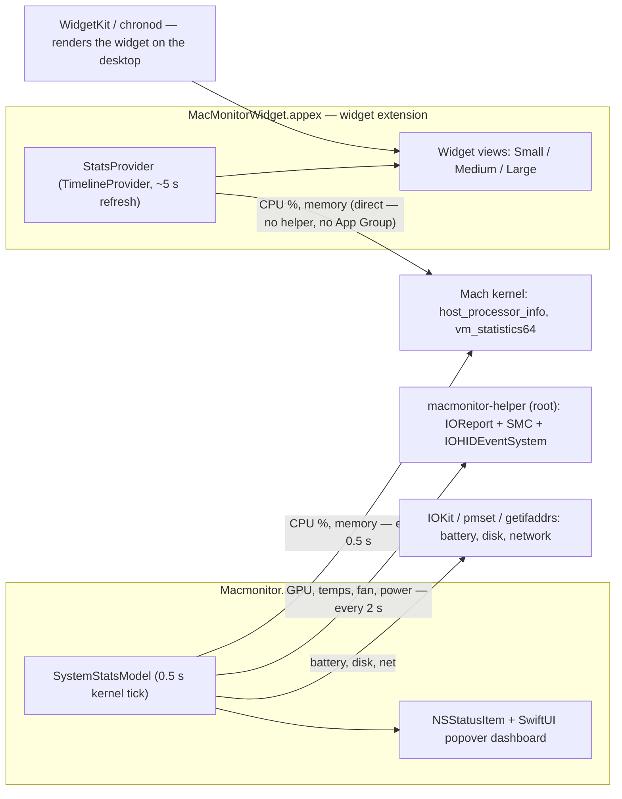
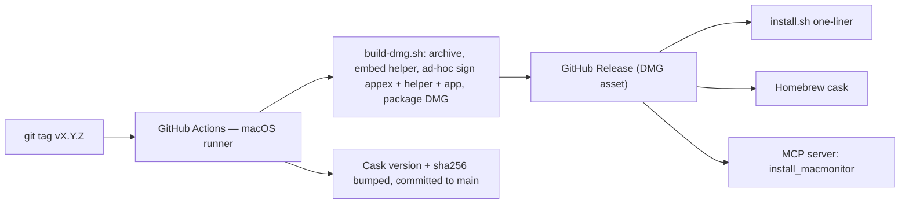

# MacMonitor — Architecture

This fork ships three executable pieces plus a release/distribution pipeline. This document
covers how they fit together, what samples what (and how often), and why the widget and the
dashboard have different refresh rates.

## System overview



## Components

| Component | Process | Privileges | Role |
|---|---|---|---|
| `Macmonitor.app` | Long-running menu-bar app | User | Menu-bar indicator + full dashboard popover. Owns `SystemStatsModel`. |
| `macmonitor-helper` | Spawned per sample, exits | Root (one-time admin approval) | Reads IOReport/SMC/HID for GPU %, temperatures, fan RPM, power rails, DRAM bandwidth. |
| `MacMonitorWidgetExtension.appex` | Spawned by WidgetKit per timeline refresh | User (standalone) | Desktop widget. Samples its own data in-process — works with the app closed. |
| Desktop HUD (`AdaptiveHUDView` + `DesktopHUDView`, in AppDelegate.swift) | Inside the app process | User | Resizable borderless panel (`HUDPanel`, key-capable for text input) at desktop window level, fed by the same 0.5 s `@Published` stream. v2.2 control center: breakpoint layout, DASH/FILES tabs, embedded zsh console (splittable ≤4 panes), launcher tile grid, position lock, device-aware default sizing clamped above the Dock. |

## Sampling design — two cadences, push-based

`SystemStatsModel` is an `ObservableObject`; every metric is `@Published`. SwiftUI views
subscribe once and receive **pushed** updates — there is no per-tick view initialization or
polling cost on the UI side.

The sampler runs two cadences because the data sources have very different costs:

- **Kernel metrics (0.5 s)** — CPU overall + per-core (`host_processor_info`), memory
  (`vm_statistics64`), swap (`sysctl`), network (`getifaddrs` delta). These are in-process
  syscalls costing microseconds; sampling them at 2 Hz is effectively free.
- **Helper metrics (2 s)** — GPU, temps, fan, power rails. Each sample **spawns the root
  helper process** (fork/exec + JSON over stdout). That per-call init cost is why these are
  gated to every 4th tick rather than run at 0.5 s.
- **Battery (~10 s)** and **disk I/O (6 s, separate timer)** — slow-moving data; `ioreg` can
  take seconds, so disk runs on its own timer and never blocks the sampler queue.

## Update frequency

| Surface | Metrics | Cadence |
|---|---|---|
| Desktop widget | CPU, memory, network, battery, thermal | ~5 s — WidgetKit best-effort (see below) |
| Menu bar + dashboard | CPU (overall + per-core), memory, swap, network | **0.5 s** |
| Dashboard | GPU, temperatures, fan, power rails | 2 s |
| Dashboard | Battery | ~10 s |
| Dashboard | Disk I/O | 6 s |

### Why the widget can't tick at 0.5 s

WidgetKit widgets are **rendered snapshots**, not live views: `chronod` cold-starts the
extension process, asks the `TimelineProvider` for entries, renders them, and kills the
process. The OS throttles how often it honors reload requests — our 5-second
`.after(...)` policy is already the practical ceiling, and macOS may stretch it under load
or in Low Power Mode. Sub-second streaming inside a widget is not possible on this platform;
that's what the menu-bar dashboard is for.

The widget compensates by being fully standalone: each refresh takes its own two-sample CPU
delta (0.8 s window) and reads memory/network/battery directly — no App Group, no helper, no
dependency on the app running.

This fork ships two workarounds: the app calls `WidgetCenter.reloadAllTimelines()` every
5 s (app-driven reloads are honored far more reliably than the widget's own timeline
policy), and the **Desktop HUD** — an app-rendered floating panel at desktop window level
that updates at the full 0.5 s stream rate, since it lives inside the app process where
WidgetKit's throttle doesn't apply.

### HUD control center (v2.2)

The Full HUD hosts `AdaptiveHUDView` in a resizable `HUDPanel` (an `NSPanel` subclass that
can become key, so text input works in a nonactivating desktop panel; the hosting
controller's `sizingOptions` are empty so the window owns its size). Layout re-flows by
breakpoint: width ≥980 → 4 columns (adds GPU/power rails), ≥700 → 3, else 2; aspect taller
than 1:1.3 → stacked vertical. Defaults are device-aware — sized from the display's
`visibleFrame` (which excludes the menu bar and Dock) and parked bottom-right above the
Dock; restored frames pass a sanity guard that resets degenerate (zero-height) frames and
clamps everything into the visible area. A lock toggle (`hudLocked`) freezes position and
size. Tabs switch between the dashboard and a FileManager-backed directory explorer. The
embedded terminal runs each command via `Process` (`/bin/zsh -lc`) with streamed
stdout/stderr and `cd`/`clear` built-ins, splittable to 4 panes — a command console, not a
full TTY (a terminal-emulator dependency like SwiftTerm is the upgrade path). Launcher
tiles persist as JSON in `UserDefaults` (`LauncherStore`): each `LauncherItem` carries an
optional group plus background (`bgHex`) and text (`fgHex`) colors, and the ordered group
list lives under `hudLauncherGroups`. The HUD renders one collapsible `LauncherGroupView`
per group, each in its own coordinate space so a long-press (~1.5 s) + drag reorders within
that group (yellow + revolving-rainbow "armed" highlight, cleared on release); the editor
offers the same reorder via a `List`/`.onMove` ≡ drag handle. Both views mutate the single
shared `LauncherStore.items`, so editor and HUD stay in sync. Volume buttons drive
AppleScript `set volume output volume`. One design note: everything lives in `AppDelegate.swift` by
choice — adding source files to the Xcode target would require pbxproj edits, which this
fork's CLI-driven workflow avoids.

## Release & distribution pipeline



- **Signing:** ad-hoc (no paid Apple Developer account). Apple Silicon requires at least an
  ad-hoc signature on every binary — the widget `.appex` is signed inside-out (appex →
  helper → app) or WidgetKit refuses to register it on end-user machines. The app is not
  notarized; all install paths clear the quarantine flag so users never hit the Gatekeeper
  "Move to Trash" dialog.
- **Install paths:** `install.sh` (curl one-liner — download, install, quarantine-clear,
  launch, verify, self-clean), Homebrew cask (auto-bumped each release), manual DMG, and an
  **MCP server** (`npx -y github:MAKaminski/MacMonitor`) exposing `install_macmonitor`,
  `macmonitor_status`, and `uninstall_macmonitor` so AI agents can install it directly —
  see [llms-install.md](llms-install.md).

## Source map

| Path | What |
|---|---|
| `Macmonitor/SystemStatsModel.swift` | All app-side sampling; two-cadence timer logic |
| `Macmonitor/AppDelegate.swift` | Menu-bar item + popover + the entire HUD control center (adaptive layout, tabs, terminal, files, launcher, lock) |
| `MacMonitorWidget/MacMonitorWidget.swift` | Widget provider + Small/Medium/Large views (no `@main`) |
| `MacMonitorWidget/MacMonitorWidgetBundle.swift` | Widget `@main` entry point |
| `helper/macmonitor-helper.m` | Root helper (IOReport/SMC/HID sampling) |
| `scripts/build-dmg.sh` | Release build: archive → helper → ad-hoc sign → DMG |
| `.github/workflows/release.yml` | Tag-triggered release pipeline |
| `mcp/server.js` | MCP install/status/uninstall server |

---

## HUD tabs & data sources (2.5.0)

The adaptive HUD (`AdaptiveHUDView` in `AppDelegate.swift`) hosts ten tabs, each
backed by its own store:

| Tab | View / store | Source |
|---|---|---|
| DASH | `AdaptiveHUDView` + `SystemStatsModel` | in-process kernel sampling (0.5 s) |
| FILES | file browser | working directory |
| FIN | `FinanceStore` | M1 GraphQL poller → countdown / daily P-L |
| CHARTS | `ChartsView` | ring buffers of metric history (1 s … 1 mo) |
| CAL | `CalendarTab` | Google + Outlook events (next 7 days) |
| MONARCH | `MonarchTab` | Monarch Money session (cookie + 1Password-token pollers) |
| WHATNOT | `WhatnotStore` / `WhatnotTab` | `~/.config/macmonitor/whatnot.json` (producer run in-process — see below) |
| OURA | `OuraService` / `OuraTab` | Oura API v2 (`~/.config/oura/token`) |
| iMSG | `MessagesStore` / `ContactsResolver` | `~/Library/Messages/chat.db` + Contacts (1:1 **and group-thread participant names**) |
| CLAUDE | `ClaudeChatStore` / `ClaudeTab` | local Claude task bridge (see below) |

### Badge pipeline (decoupled producer → consumer)

```
mail-poller.py (LaunchAgent, every 5 min) ──writes──▶ ~/.config/macmonitor/badges/<kind>.count
                                                              │  polled (≤ 2 s)
                                          BadgeStore ◀─────────┘
                                              │ total(for: LauncherItem) sums per-account badges
                                              ▼
        LauncherButton (red overlay)   AccountPopover (per-account flags)   HUDTabButton (iMSG unread)
```

The app never knows *how* a count was produced — it only reads the `.count`
files. Today the producer is an IMAP LaunchAgent
(`de.modularequity.macmonitor.mailpoller`); swapping the producer requires no
app change.

### Window-position persistence

`showHUD()` restores `hudFrameSaved-<style>` (an `NSStringFromRect`) **before**
AppKit autosave or device defaults; the header drag writes it back on
`.onEnded`. Because the frame is stored in absolute global coordinates and the
restore is clamped to a live screen, the HUD returns to the same spot on the
same monitor after an update or reinstall.

### Agent-app permission prompts (LSUIElement)

MacMonitor runs as `LSUIElement` (no Dock icon), so it cannot present a TCC
consent prompt while it remains an accessory. Two workarounds are in play:

- **Automation (Messages send):** route the AppleScript through a child
  `/usr/bin/osascript` process, which surfaces the consent prompt.
- **Contacts:** flip `NSApp.activationPolicy` to `.regular` + `activate` for the
  first `CNContactStore.requestAccess`, then revert to `.accessory`.

### Local Claude task bridges (Craft Auto Response + CLAUDE tab)

Two features hand work to **ad-hoc local Claude scheduled tasks** instead of calling the
Anthropic API in-process — so each tracks usage independently and can draft using the user's
own memory/context. Both use the same file handshake under
`~/Documents/Claude/Projects/Personal/` (chosen so the task can reach it with plain file
tools, no Full Disk Access required):

| Feature | Folder | Task | Trigger |
|---|---|---|---|
| iMSG **Craft Auto Response** (`MessagesStore.craftReply`) | `craft-auto-response/` | `macmonitor-craft-auto-response` | manual |
| **CLAUDE** tab (`ClaudeChatStore.send`) | `claude-agent-bridge/` | `macmonitor-claude-agent` | manual |

Flow: the app writes `request.json` (`{ nonce, status:"pending", … }`) and polls (2 s, 5-min
timeout) for a `response.json` carrying the **same nonce**. The task drafts the reply, writes
`response.json`, and marks the request `done`. The app then drops the result into the
iMessage draft box (Craft — **never auto-sends**) or appends it to the agent thread (CLAUDE
tab). No Anthropic API key is needed in-app; the old `~/.config/macmonitor/anthropic_key`
path is retired for these two features.

### Whatnot producer — run in-process

The `whatnot-service` producer reads a source spreadsheet in **iCloud Drive**, which the
`de.modularequity.macmonitor.whatnot` LaunchAgent cannot read (launchd jobs lack Full Disk
Access → `Errno 1: Operation not permitted`, so the data went stale). MacMonitor already
holds FDA (it reads `chat.db`), so `WhatnotStore.start()` — kicked at launch from
`applicationDidFinishLaunching` — runs the producer itself (`python3 -m whatnot_service.cli`,
spawned via `Process`) on launch and every 15 minutes, then reloads `whatnot.json`. The
standalone LaunchAgent is now redundant. This is the same "app has the permission, so the app
does the work" pattern used for Messages send/Contacts.
