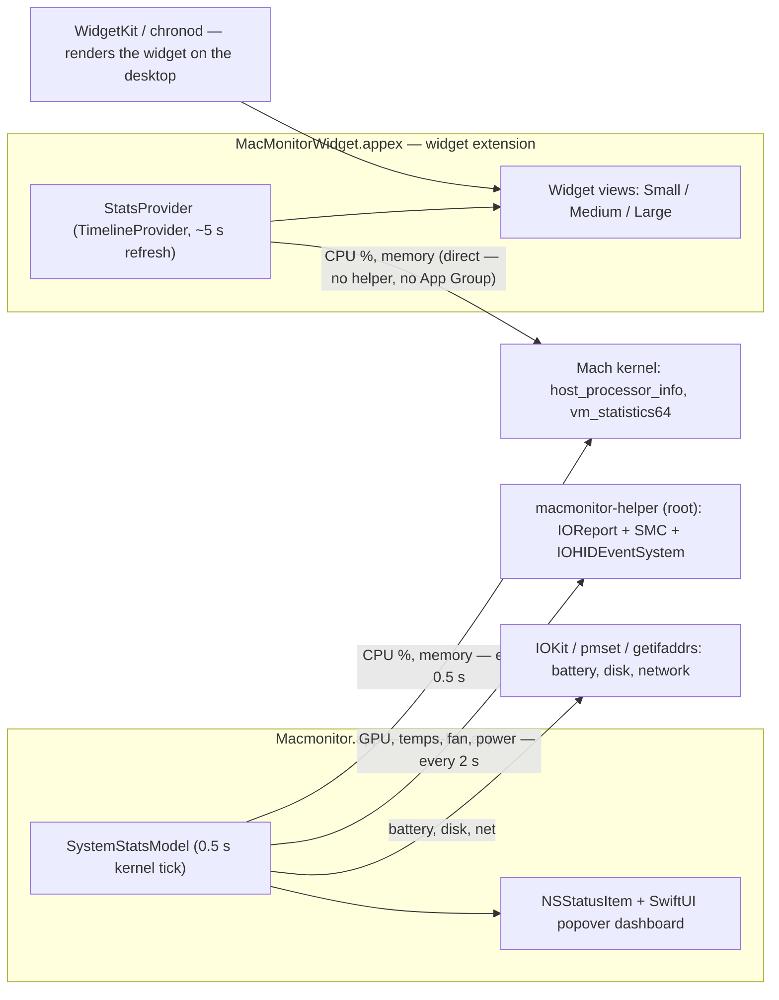
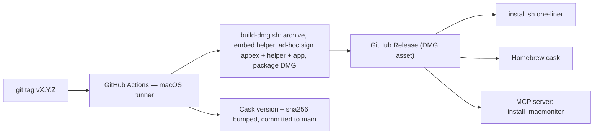

# MacMonitor — Architecture

This fork ships three executable pieces plus a release/distribution pipeline. This document
covers how they fit together, what samples what (and how often), and why the widget and the
dashboard have different refresh rates.

## System overview

## Components

| Component | Process | Privileges | Role |
|---|---|---|---|
| `Macmonitor.app` | Long-running menu-bar app | User | Menu-bar indicator + full dashboard popover. Owns `SystemStatsModel`. |
| `macmonitor-helper` | Spawned per sample, exits | Root (one-time admin approval) | Reads IOReport/SMC/HID for GPU %, temperatures, fan RPM, power rails, DRAM bandwidth. |
| `MacMonitorWidgetExtension.appex` | Spawned by WidgetKit per timeline refresh | User (standalone) | Desktop widget. Samples its own data in-process — works with the app closed. |
| Desktop HUD (`DesktopHUDView`, in AppDelegate.swift) | Inside the app process | User | Borderless panel pinned at desktop-icon window level. Subscribes to the same 0.5 s `@Published` stream — the WidgetKit refresh workaround. Toggle via right-click menu; position persisted. |

## Sampling design — two cadences, push-based

`SystemStatsModel` is an `ObservableObject`; every metric is `@Published`. SwiftUI views
subscribe once and receive **pushed** updates — there is no per-tick view initialization or
polling cost on the UI side.

The sampler runs two cadences because the data sources have very different costs:

- **Kernel metrics (0.5 s)** — CPU overall + per-core (`host_processor_info`), memory
  (`vm_statistics64`), swap (`sysctl`), network (`getifaddrs` delta). These are in-process
  syscalls costing microseconds; sampling them at 2 Hz is effectively free.
- **Helper metrics (2 s)** — GPU, temps, fan, power rails. Each sample **spawns the root
  helper process** (fork/exec + JSON over stdout). That per-call init cost is why these are
  gated to every 4th tick rather than run at 0.5 s.
- **Battery (~10 s)** and **disk I/O (6 s, separate timer)** — slow-moving data; `ioreg` can
  take seconds, so disk runs on its own timer and never blocks the sampler queue.

## Update frequency

| Surface | Metrics | Cadence |
|---|---|---|
| Desktop widget | CPU, memory, network, battery, thermal | ~5 s — WidgetKit best-effort (see below) |
| Menu bar + dashboard | CPU (overall + per-core), memory, swap, network | **0.5 s** |
| Dashboard | GPU, temperatures, fan, power rails | 2 s |
| Dashboard | Battery | ~10 s |
| Dashboard | Disk I/O | 6 s |

### Why the widget can't tick at 0.5 s

WidgetKit widgets are **rendered snapshots**, not live views: `chronod` cold-starts the
extension process, asks the `TimelineProvider` for entries, renders them, and kills the
process. The OS throttles how often it honors reload requests — our 5-second
`.after(...)` policy is already the practical ceiling, and macOS may stretch it under load
or in Low Power Mode. Sub-second streaming inside a widget is not possible on this platform;
that's what the menu-bar dashboard is for.

The widget compensates by being fully standalone: each refresh takes its own two-sample CPU
delta (0.8 s window) and reads memory/network/battery directly — no App Group, no helper, no
dependency on the app running.

This fork ships two workarounds: the app calls `WidgetCenter.reloadAllTimelines()` every
5 s (app-driven reloads are honored far more reliably than the widget's own timeline
policy), and the **Desktop HUD** — an app-rendered floating panel at desktop window level
that updates at the full 0.5 s stream rate, since it lives inside the app process where
WidgetKit's throttle doesn't apply.

## Release & distribution pipeline

- **Signing:** ad-hoc (no paid Apple Developer account). Apple Silicon requires at least an
  ad-hoc signature on every binary — the widget `.appex` is signed inside-out (appex →
  helper → app) or WidgetKit refuses to register it on end-user machines. The app is not
  notarized; all install paths clear the quarantine flag so users never hit the Gatekeeper
  "Move to Trash" dialog.
- **Install paths:** `install.sh` (curl one-liner — download, install, quarantine-clear,
  launch, verify, self-clean), Homebrew cask (auto-bumped each release), manual DMG, and an
  **MCP server** (`npx -y github:MAKaminski/MacMonitor`) exposing `install_macmonitor`,
  `macmonitor_status`, and `uninstall_macmonitor` so AI agents can install it directly —
  see [llms-install.md](llms-install.md).

## Source map

| Path | What |
|---|---|
| `Macmonitor/SystemStatsModel.swift` | All app-side sampling; two-cadence timer logic |
| `Macmonitor/AppDelegate.swift` | Menu-bar item + popover |
| `MacMonitorWidget/MacMonitorWidget.swift` | Widget provider + Small/Medium/Large views (no `@main`) |
| `MacMonitorWidget/MacMonitorWidgetBundle.swift` | Widget `@main` entry point |
| `helper/macmonitor-helper.m` | Root helper (IOReport/SMC/HID sampling) |
| `scripts/build-dmg.sh` | Release build: archive → helper → ad-hoc sign → DMG |
| `.github/workflows/release.yml` | Tag-triggered release pipeline |
| `mcp/server.js` | MCP install/status/uninstall server |
