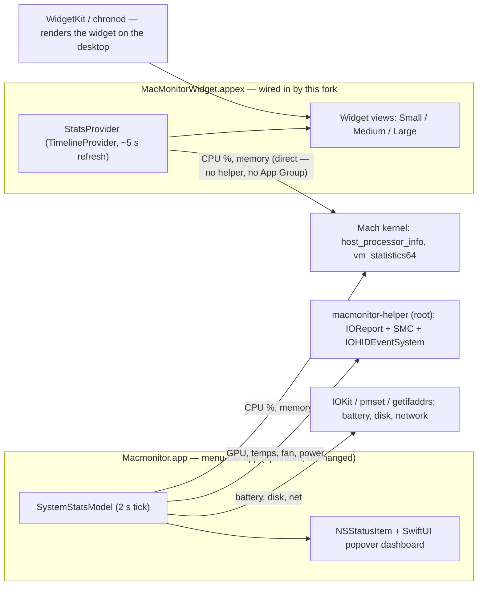

# MacMonitor — Kaminski Fork

This is **Michael Kaminski's customized version** of
[MacMonitor](https://github.com/ryyansafar/MacMonitor), forked from
[@ryyansafar](https://github.com/ryyansafar)'s original. All core monitoring work is his —
this fork exists to ship the **desktop widget** that the upstream project never wired in.

## Why this fork exists

Upstream is an excellent Apple Silicon menu-bar system monitor, and its repo even contains
widget source (`MacMonitorWidget/MacMonitorWidget.swift`) — but the Xcode project never
included a widget *target*. As a result, no released build (DMG or Homebrew) ever contained
the widget, and cloning + building upstream produces the menu-bar app only.

## What's different here

| Area | Upstream | This fork |
|---|---|---|
| Widget target in `Macmonitor.xcodeproj` | Absent — widget source unbuildable | Wired in as a Widget Extension, embedded in the app |
| Widget sizes | Small, Medium (source only) | Small, Medium, **Large** |
| In-widget third-party donation links | Present | Removed |
| Widget data collection | — | Self-contained in-process sampling: per-core CPU, MEM/swap, network, battery, thermal |
| Dashboard refresh | 2 s tick | 0.5 s kernel-metric stream (`@Published` push); root-helper sensors stay at 2 s |
| Menu-bar app | v2.x | Otherwise unchanged |
| Desktop HUD | — | Adaptive control center: resizable breakpoint layout, DASH/FILES tabs, embedded zsh terminal (splittable), launcher tile grid, position lock, device-aware sizing that clears the Dock |
| Install paths | DMG + brew + script | Same, plus an **MCP server** so AI agents can install it directly |

## Install

**One-liner** (downloads the latest release, installs, clears quarantine, launches — cleans up after itself):

```
curl -fsSL https://raw.githubusercontent.com/MAKaminski/MacMonitor/main/install.sh | bash
```

**Homebrew:**

```
brew tap MAKaminski/macmonitor https://github.com/MAKaminski/MacMonitor
brew install --cask macmonitor
```

**Manual:** grab the DMG from [Releases](https://github.com/MAKaminski/MacMonitor/releases), drag to Applications, double-click `Install.command`.

**AI agent / MCP:** this repo is also an MCP server. Point your agent at it and ask it to install:

```json
{ "mcpServers": { "macmonitor": { "command": "npx", "args": ["-y", "github:MAKaminski/MacMonitor"] } } }
```

Tools: `install_macmonitor` · `macmonitor_status` · `uninstall_macmonitor`. Details in [llms-install.md](llms-install.md).

**Updating:** re-run any install path — it replaces the app in place. No uninstall needed.

## Update frequency

| Surface | Metrics | Cadence |
|---|---|---|
| Desktop widget | CPU, memory, network, battery, thermal | ~5 s — WidgetKit best-effort ceiling (macOS may stretch it under load or Low Power Mode) |
| Menu bar + dashboard | CPU (overall + per-core), memory, swap, network | **0.5 s** — in-process push stream |
| **Desktop HUD** (right-click menu-bar icon → "Show Desktop HUD") | CPU, memory, network, thermal | **0.5 s** — app-rendered floating panel; the WidgetKit workaround |
| Dashboard | GPU, temperatures, fan, power rails | 2 s (root helper) |
| Dashboard | Battery | ~10 s |
| Dashboard | Disk I/O | 6 s |

Widgets are rendered snapshots — WidgetKit cold-starts the extension per refresh and
throttles reloads, so ~5 s is the platform ceiling (the app nudges WidgetKit every 5 s to
keep the widget at that ceiling). For true sub-second numbers on your desktop, use the
**Desktop HUD**: right-click the menu-bar icon → *Show Desktop HUD*.

## The Desktop HUD (v2.2 control center)

The Full HUD is a **resizable desktop control center** rendered by the app from the 0.5 s
stream. Drag any edge to resize — the layout re-flows by breakpoint (≥980 px wide → 4
columns including GPU/power rails, ≥700 → 3, narrower → 2; taller than wide → stacked). It
defaults to a horizontal bar sized to your display's visible area, parked bottom-right
**above the Dock**, and restored frames are clamped so they can never hide off-screen or
under the Dock.

- **DASH | FILES tabs** — performance overview, or a click-to-navigate directory explorer
  (folders descend, files open in their default app, Reveal in Finder).
- **Embedded terminal** (bottom-right) — zsh console with streamed output, `cd`/`clear`
  built-ins, splittable up to 4 panes. (Command console, not a full TTY — no vim/htop.)
- **Launcher** (bottom-left) — deckboard-style tile grid; defaults M1 / Monarch / Schwab /
  Gmail, add your own via the **+** editor, right-click a tile to remove, plus system
  **Vol −/+** controls.
- **Lock** — right-click the HUD → *Lock HUD* to freeze position and size.
- A **Compact** style (small CPU/MEM card) is available via the right-click menu; position
  and style persist per style.

The HUD is **independent of the menu bar**: choose *Hide Menu Bar Icon (HUD keeps running)*
to run HUD-only. Right-click the HUD itself for its controls (show menu icon, switch style,
lock, hide, quit) — the app guarantees at least one surface is always visible. Full
rationale: [ARCHITECTURE.md](ARCHITECTURE.md).

## Architecture

The key design point: **the widget collects its own data.** It samples the Mach kernel
directly inside the widget process on each timeline refresh (~5 s), so it works even when the
menu-bar app is closed — and it never needs the root helper or an App Group.

Deep dive — components, sampling cadences, release pipeline: [ARCHITECTURE.md](ARCHITECTURE.md).



Two processes, two data paths:

- **Menu-bar app** (rich dashboard): CPU, GPU, memory, battery, power rails, fan, network,
  and disk — GPU/temps/power via the privileged `macmonitor-helper` (root, IOReport + SMC).
- **Widget** (standalone): CPU two-sample delta via `host_processor_info`, memory via
  `vm_statistics64`, thermal via `ProcessInfo` — all in-process. No helper, no App Group, no
  background process.

## Building

Requirements: Apple Silicon Mac · macOS 13+ (desktop widget placement needs macOS 14+) ·
Xcode 15+ · free Apple ID.

1. Clone this repo and open `Macmonitor.xcodeproj`.
2. Set your **Team** under Signing & Capabilities on **both** targets
   (`Macmonitor` and `MacMonitorWidget`).
3. Scheme **Macmonitor › My Mac** → **⌘R**. The widget builds and registers with the app.
4. Right-click the desktop → **Edit Widgets** → **MacMonitor** → drag Small / Medium / Large.

Verify registration any time:

```
pluginkit -mAvp com.apple.widgetkit-extension | grep -i monitor
```

## Credit & license

- Original author: [Ryyan Safar](https://github.com/ryyansafar) —
  [upstream repo](https://github.com/ryyansafar/MacMonitor). If you find the core app useful,
  support him there.
- License: MIT, unchanged from upstream — see [LICENSE](LICENSE).
- Fork maintained by **Michael Kaminski**.
