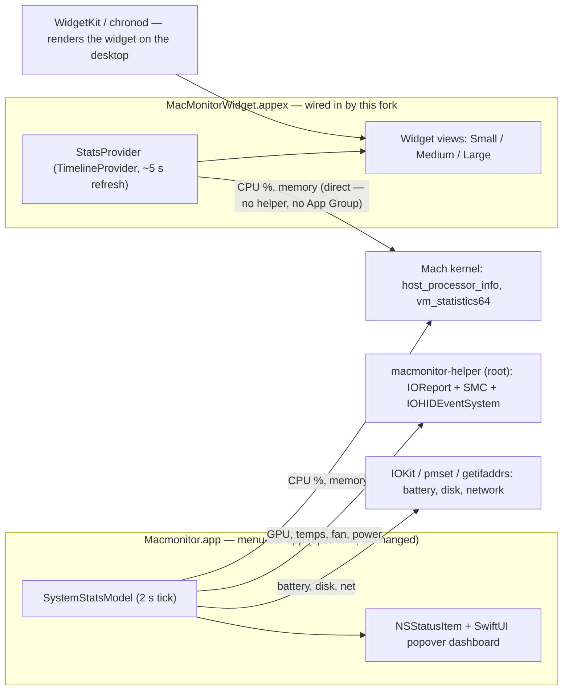

# MacMonitor — Kaminski Fork

This is **Michael Kaminski's customized version** of
[MacMonitor](https://github.com/ryyansafar/MacMonitor), forked from
[@ryyansafar](https://github.com/ryyansafar)'s original. All core monitoring work is his —
this fork exists to ship the **desktop widget** that the upstream project never wired in.

## Why this fork exists

Upstream is an excellent Apple Silicon menu-bar system monitor, and its repo even contains
widget source (`MacMonitorWidget/MacMonitorWidget.swift`) — but the Xcode project never
included a widget *target*. As a result, no released build (DMG or Homebrew) ever contained
the widget, and cloning + building upstream produces the menu-bar app only.

## What's different here

| Area | Upstream | This fork |
|---|---|---|
| Widget target in `Macmonitor.xcodeproj` | Absent — widget source unbuildable | Wired in as a Widget Extension, embedded in the app |
| Widget sizes | Small, Medium (source only) | Small, Medium, **Large** |
| In-widget third-party donation links | Present | Removed |
| Widget data collection | — | Unchanged from upstream design: self-contained Mach sampling |
| Menu-bar app | v2.x | Unchanged |

## Architecture

The key design point: **the widget collects its own data.** It samples the Mach kernel
directly inside the widget process on each timeline refresh (~5 s), so it works even when the
menu-bar app is closed — and it never needs the root helper or an App Group.



Two processes, two data paths:

- **Menu-bar app** (rich dashboard): CPU, GPU, memory, battery, power rails, fan, network,
  and disk — GPU/temps/power via the privileged `macmonitor-helper` (root, IOReport + SMC).
- **Widget** (standalone): CPU two-sample delta via `host_processor_info`, memory via
  `vm_statistics64`, thermal via `ProcessInfo` — all in-process. No helper, no App Group, no
  background process.

## Building

Requirements: Apple Silicon Mac · macOS 13+ (desktop widget placement needs macOS 14+) ·
Xcode 15+ · free Apple ID.

1. Clone this repo and open `Macmonitor.xcodeproj`.
2. Set your **Team** under Signing & Capabilities on **both** targets
   (`Macmonitor` and `MacMonitorWidget`).
3. Scheme **Macmonitor › My Mac** → **⌘R**. The widget builds and registers with the app.
4. Right-click the desktop → **Edit Widgets** → **MacMonitor** → drag Small / Medium / Large.

Verify registration any time:

```
pluginkit -mAvp com.apple.widgetkit-extension | grep -i monitor
```

## Credit & license

- Original author: [Ryyan Safar](https://github.com/ryyansafar) —
  [upstream repo](https://github.com/ryyansafar/MacMonitor). If you find the core app useful,
  support him there.
- License: MIT, unchanged from upstream — see [LICENSE](LICENSE).
- Fork maintained by **Michael Kaminski**.
